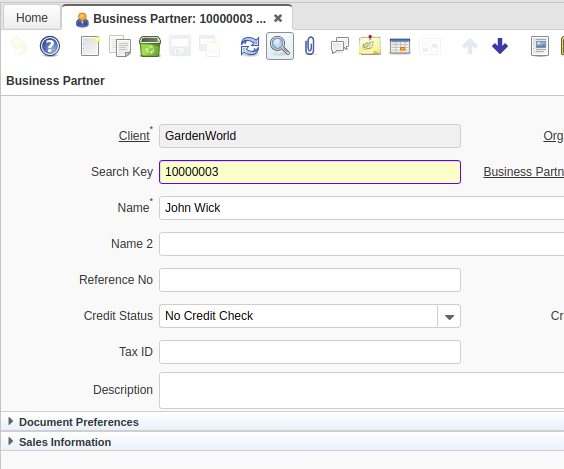
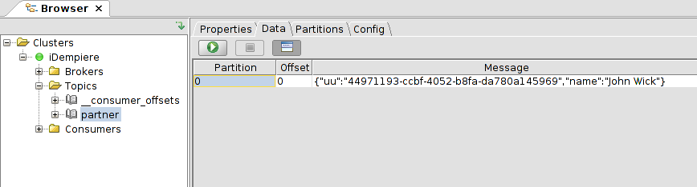

# iDempiere Kafka Plugin

- Copyright: 2020 INGEINT <https://www.ingeint.com>
- Repository: https://github.com/ingeint/idempiere-kafka-plugin
- License: GPL 2

## Description

This plugin is an example of using kafka comsumer/producer client with iDempiere.

## Contributors

- [Saúl Piña](https://github.com/sauljabin)

## Components

- iDempiere Plugin [com.ingeint.kafka](com.ingeint.kafka)
- iDempiere Unit Test Fragment [com.ingeint.kafka.test](com.ingeint.kafka.test)
- iDempiere Target Platform [com.ingeint.kafka.targetplatform](com.ingeint.kafka.targetplatform)

## Prerequisites

- Java 11, commands `java` and `javac`.
- iDempiere 7.1.0
- Set `IDEMPIERE_REPOSITORY` env variable
- GNU make

## Features/Documentation

#### This example does not include
- Idempotent producer
- Security
- Key, Partitions, Replicas, Cluster management

#### Partner Producer
This plugin send a BPartne to the kafka topic `partner` every time a new partne is created or updated. Se the class `PartnerKafkaProducer` and `NewPartnerEvent`.

Some captures from iDempiere and Kafkatool:





## Instructions

Clone project :
```
git clone https://github.com/ingeint/idempiere-kafka-plugin.git
```

Updating submodule:
```
cd idempiere-kafka-plugin
git submodule init
git submodule update
```

Building kafka docker:
```
cd kafka-docker
make build
```

Runing kafka:
```
docker swarm init
make run
```

## Extra Links

- [Kafka](https://kafka.apache.org/)
- [Kafka Docker](https://hub.docker.com/r/sauljabin/kafka)
- GUI [Kafka Tool](http://www.kafkatool.com/)
- GUI [Conduktor](https://www.conduktor.io/)

## Commands

Compile plugin and run tests:

```bash
./build
```

Use the parameter `debug` for debug mode example:

```bash
./build debug
```

To use `.\build.bat` for windows.
